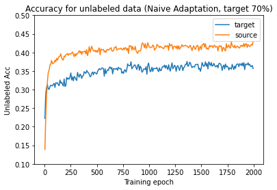
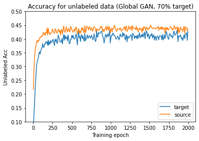
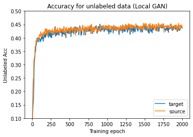
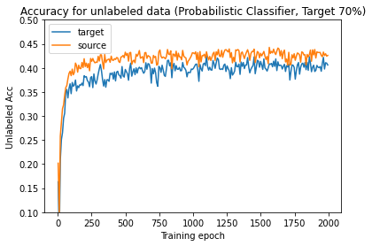
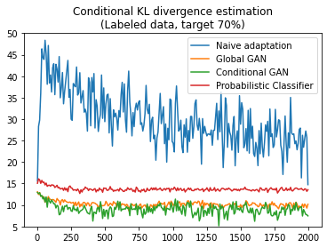

# Time-series-domain-adaptation

This is the repository for time series doamin adaptation. 


# Usage

- Data Processing
```
python data_seperation.py --data_path [data_path] --save_path [save_path] --task 3E
```

- Conditional GAN
```
python gan.py --data_path [data_path] --save_path [save_path] \
              --islocal 1 --n_critic 6 --gpweight 10 --sclass 0.7
```

- Global GAN
```
python gan.py --data_path [data_path] --save_path [save_path] \
              --isglobal 1 --n_critic 12 --gpweight 5 --sclass 0.7
```

- Conditional KL estimation
```
python conditional-kl.py --data_path [data_path] --save_path [save_path] \
                         --model_path [model_path] --model_name [model_name]
```

# Results

- Testing accuracy of different methods






- Conditional KL Divergence estimation
<p align="center">
  
</p>

